### 1.安装Docker

**更新应用程序数据库**

```
sudo yum check-update
```

**添加Docker官方仓库，安装最新Docker**

```
curl -fsSL https://get.docker.com/ | sh
```

**启动Docker**

```
sudo systemctl start docker
```

**验证是否成功启动**

```
sudo systemctl status docker
```

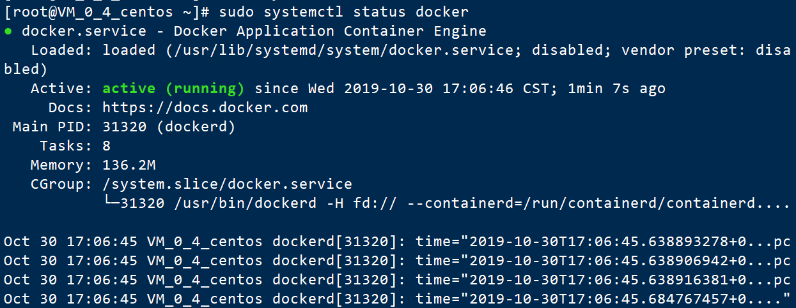

**设置Docker自启动**

```
sudo systemctl enable docker
```

**查看Docker 版本信息**

```
docker version
```

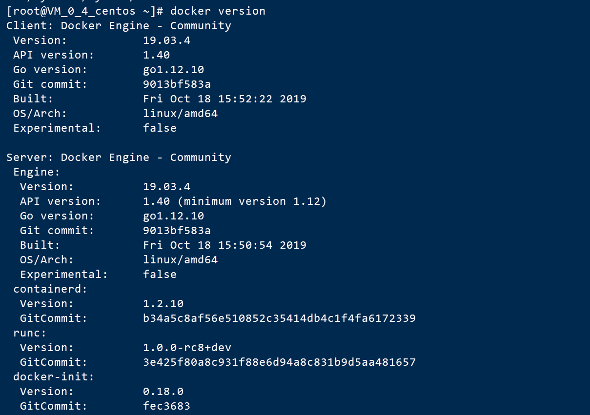

### 2.Docker加载CentOS镜像

**查看当前系统docker的相关信息：**

```
docker info
```

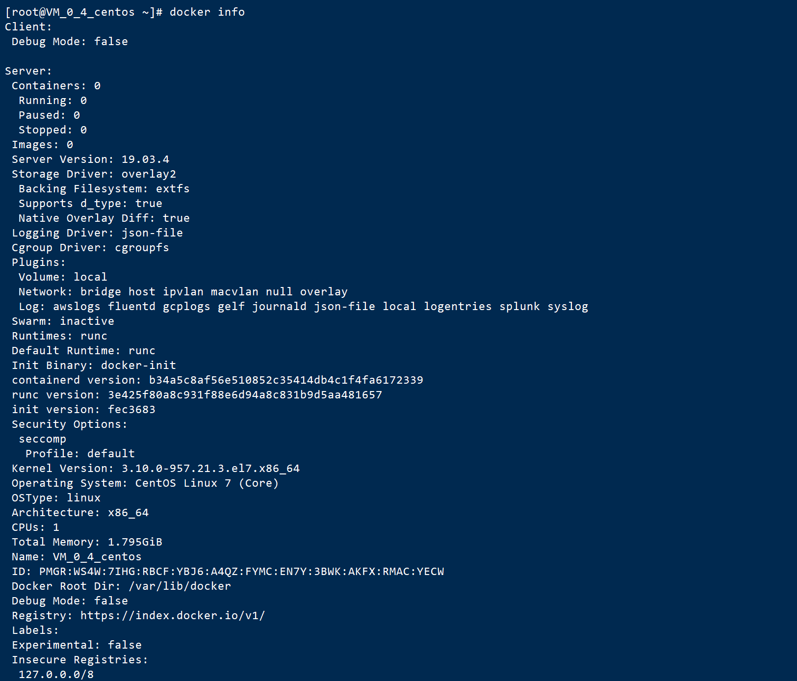

可见当前并未安装任何镜像（Images），运行任何容器（Containers）。

**使用search命令查询Docker Hub中的可用镜像**

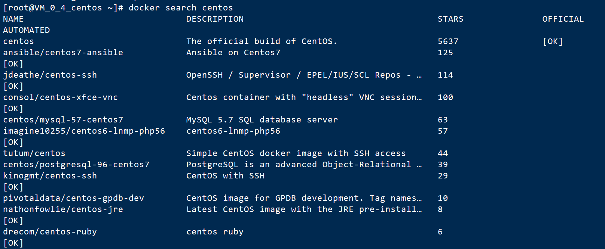

**拉取 Centos 7**

```
docker pull centos:7
```

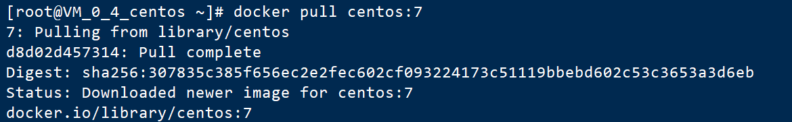

**拉取完毕后查看镜像**

```
docker images
```

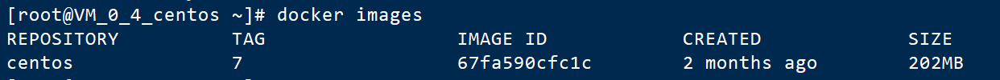

**创建并运行Docker容器（为了方便检测后续wordpress搭建是否成功，需设置端口映射（-p），将容器端口80 映射到主机端口8888，Apache和MySQL需要 systemctl 管理服务启动，需要加上参数 --privileged 来增加权，并且不能使用默认的bash，换成 init，否则会提示 Failed to get D-Bus connection: Operation not permitted ，命令如下 ）**

```
docker run -d -it --privileged --name wordpress -p 8888:80 -d centos:7 /usr/sbin/init
```

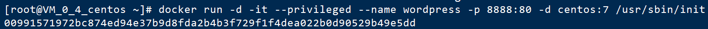

**查看已启动的容器**

```
docker ps
```

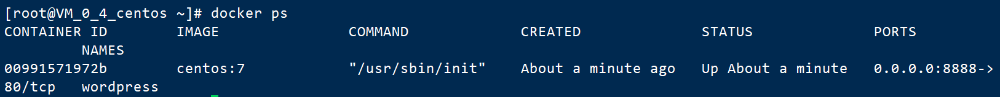

**进入容器前台（容器id可以只写前3位，如 ：009）**

```
docker exec -it 009 /bin/bash
```

### 3.容器中安装wordpress

**参照上次wordpress的安装实验过程**

**但是中间会出现**

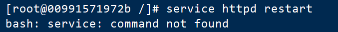

**解决步骤如下：**

```
yum list | grep initscripts
```

会出现：

initscripts.x86_64（其实一共有三个信息，但是后面根据版本不同，显示的信息也不同）

上面给出了可安装软件的yum源版本，然后执行

```
yum install initscripts -y
```

此时service命令就可用了。

**由于上次的wordpress下载链接失效了，在码云下载**

```
yum install git
git clone https://gitee.com/helang_z/wordpress.git
```

**解压**

```
cd wordpress
tar xzvf wordpress-5.2.4.tar.gz
```

**移动解压的文件**

```
rm -rf /var/www/html
mv wordpress /var/www/html
```

**网页输入ip:端口号查看**

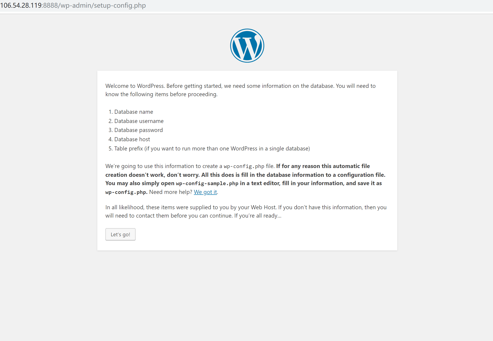

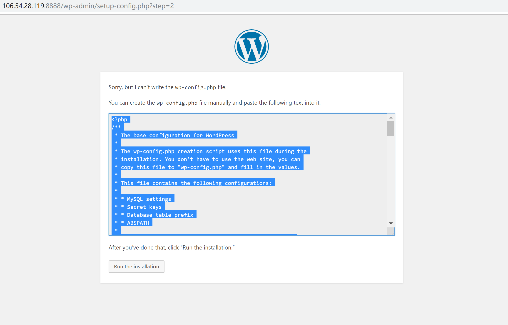

**去html下创建一个wp-content文件，内容为上图中的内容 **

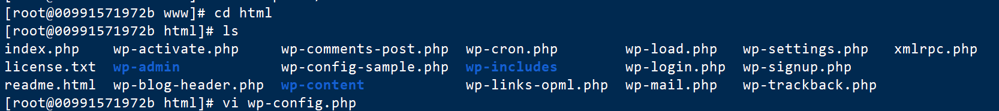

**刷新网页，开始注册**

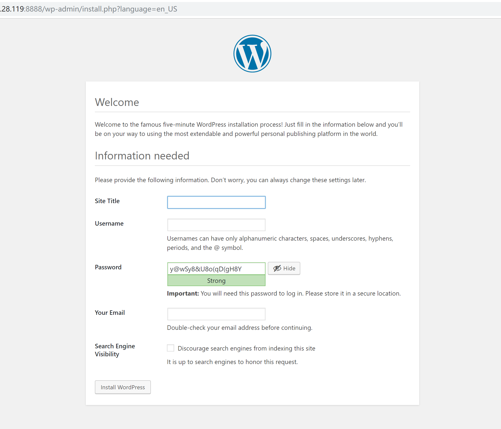

**登录**

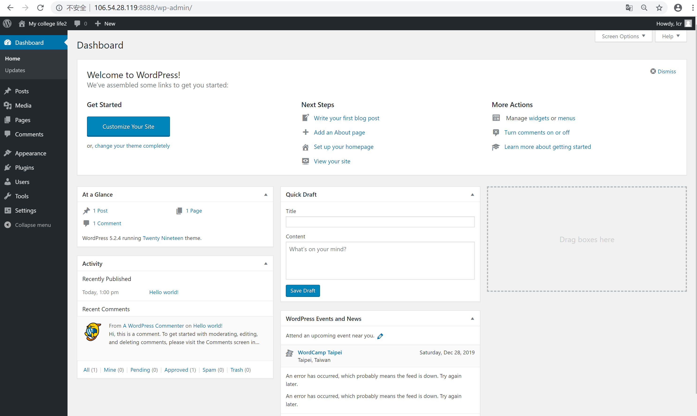

### 4.将带有WordPress的CentOS镜像推送到容器仓库

**先去docker hub官网注册**

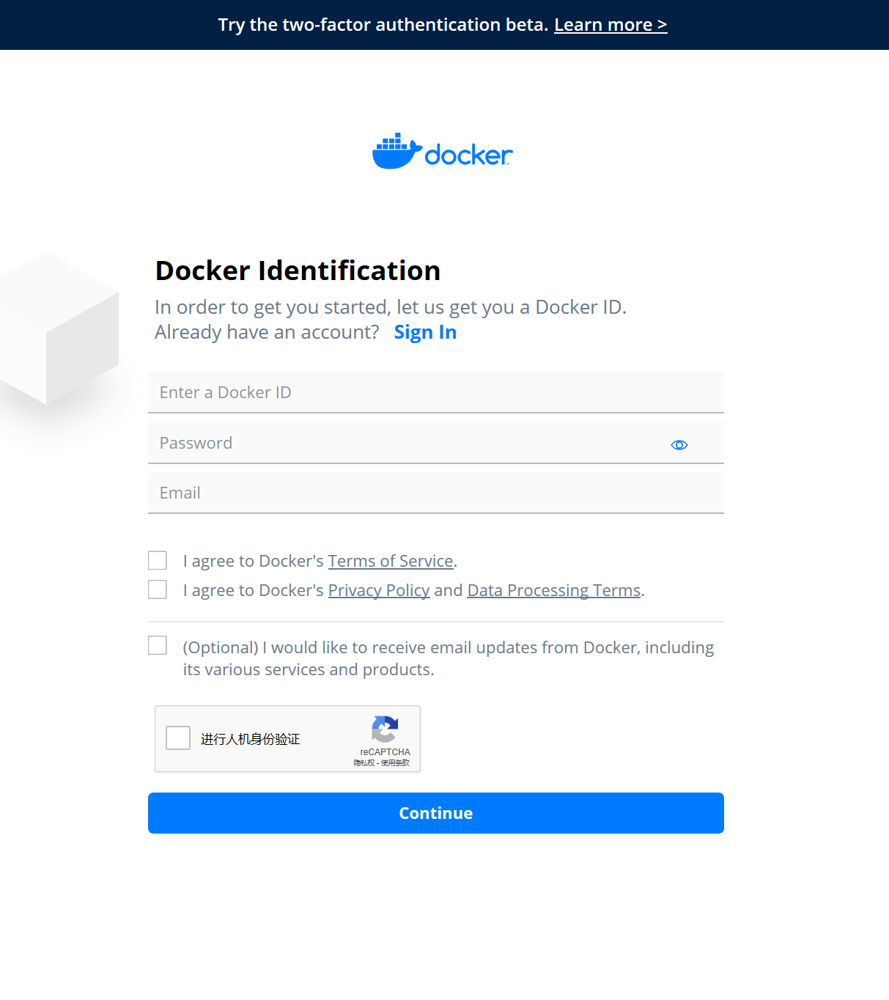

**将容器生成镜像 (所生成的镜像名由 "Docker用户名/Docker仓库名" ，否则推送会报错： denied: requested access to the resource is denied )**

```
docker commit -a "Docker用户名" -m "提交描述" 容器id 镜像名:tag标签
# 举例 docker commit -a "lcrr" -m "wordpress" 009 lcrr/centos7:v1
```

**登录Docker**

```
docker login
```

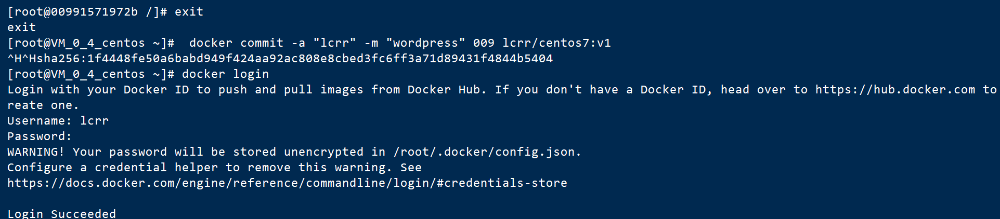

**推送镜像**

```
docker push 镜像名:tag标签
# 举例  docker push lcrr/centos7:v1
```

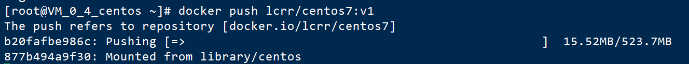

**登录Docker网页查看仓库**

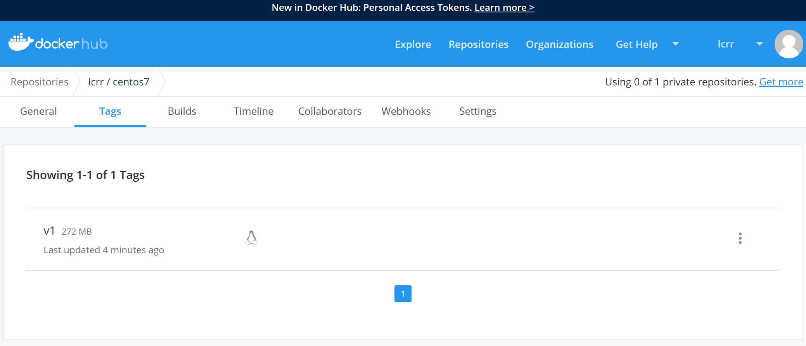

