## 实验一

### 1.安装Docker

**更新应用程序数据库**

```
sudo yum check-update
```

**添加Docker官方仓库，安装最新Docker**

```
curl -fsSL https://get.docker.com/ | sh
```

**启动Docker**

```
sudo systemctl start docker
```

**验证是否成功启动**

```
sudo systemctl status docker
```


**设置Docker自启动**

```
sudo systemctl enable docker
```

**查看Docker 版本信息**

```
docker version
```


## 实验二

### 1.Docker加载CentOS镜像

**查看当前系统docker的相关信息：**

```
docker info
```


可见当前并未安装任何镜像（Images），运行任何容器（Containers）。

**使用search命令查询Docker Hub中的可用镜像**


**拉取 Centos 7**

```
docker pull centos:7
```


**拉取完毕后查看镜像**

```
docker images
```


**创建并运行Docker容器（为了方便检测后续wordpress搭建是否成功，需设置端口映射（-p），将容器端口80 映射到主机端口8888，Apache和MySQL需要 systemctl 管理服务启动，需要加上参数 --privileged 来增加权，并且不能使用默认的bash，换成 init，否则会提示 Failed to get D-Bus connection: Operation not permitted  ）**

```
docker run -d -it --privileged --name wordpress -p 8888:80 -d centos:7 /usr/sbin/init
```


**查看已启动的容器**

```
docker ps
```


**进入容器前台（容器id可以只写前3位，如 ：009）**

```
docker exec -it 009 /bin/bash
```

### 2.容器中安装wordpress

**参照上次wordpress的安装实验过程**

**但是中间会出现**


**解决步骤如下：**

```
yum list | grep initscripts
```

会出现：

initscripts.x86_64（其实一共有三个信息，但是后面根据版本不同，显示的信息也不同）

上面给出了可安装软件的yum源版本，然后执行

```
yum install initscripts -y
```

此时service命令就可用了。

**由于上次的wordpress下载链接失效了，在码云下载**

```
yum install git
git clone https://gitee.com/helang_z/wordpress.git
```

**解压**

```
cd wordpress
tar xzvf wordpress-5.2.4.tar.gz
```

**移动解压的文件**

```
rm -rf /var/www/html
mv wordpress /var/www/html
```

**网页输入ip:端口号查看**


**去html下创建一个wp-content文件，内容为上图中的内容 **


**刷新网页，开始注册**


**登录**


### 3.将带有WordPress的CentOS镜像推送到容器仓库

**先去docker hub官网注册**


**将容器生成镜像 (所生成的镜像名由 "Docker用户名/Docker仓库名" ，否则推送会报错： denied: requested access to the resource is denied )**

```
docker commit -a "Docker用户名" -m "提交描述" 容器id 镜像名:tag标签
# 举例 docker commit -a "lcrr" -m "wordpress" 009 lcrr/centos7:v1
```

**登录Docker**

```
docker login
```


**推送镜像**

```
docker push 镜像名:tag标签
# 举例  docker push lcrr/centos7:v1
```


**登录Docker网页查看仓库**


## 实验三

#### **1. 创建工作目录**

```
mkdir /opt/dockerfile_wordpress
```

```
cd /opt/dockerfile_wordpress
```

#### **2. 创建并编写Dockerfile文件**

```
vim dockerfile
```

**文件内容：**

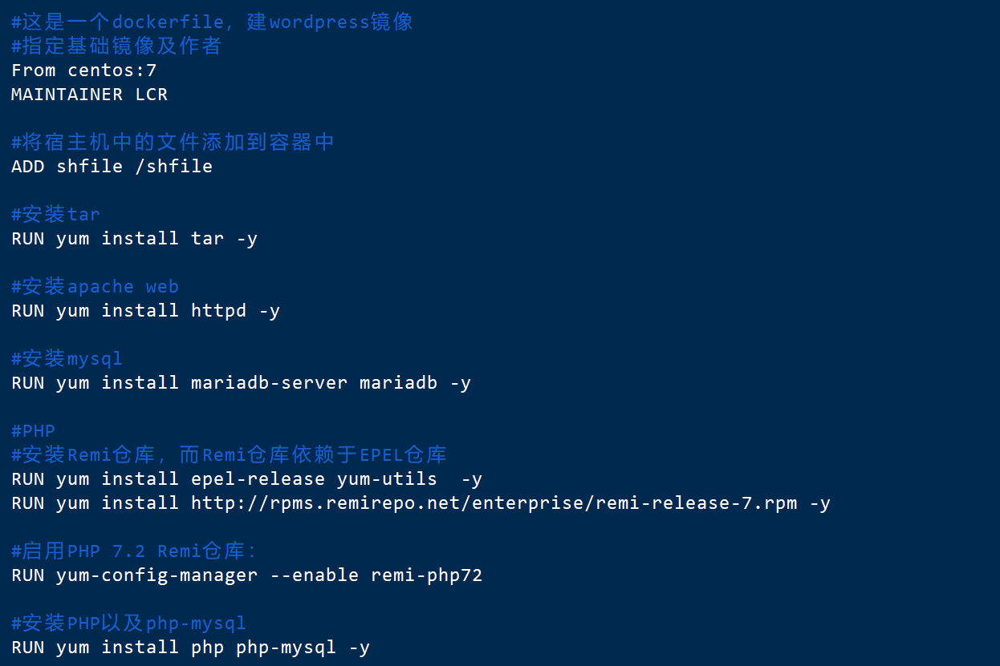

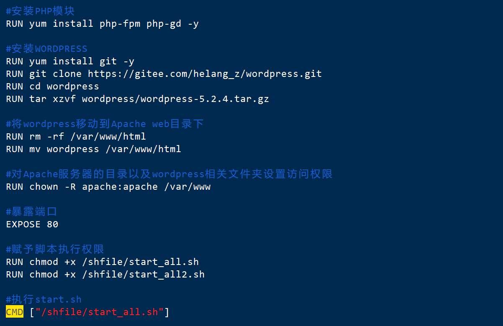

#### **3. 编写脚本文件及sql文件**

**创建shfile目录并在里面编写脚本文件**

```
mkdir shfile
```

**目录结构如下**

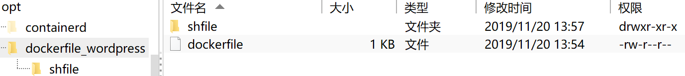

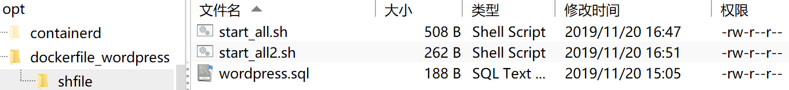

**脚本文件内容如下**

**start_all.sh**

用于第一次启动mysql，执行sql文件，启动httpd，第一次执行后删除，以后执行start_all2.sh。

启动mysql和httpd的语句来自各自的service文件。

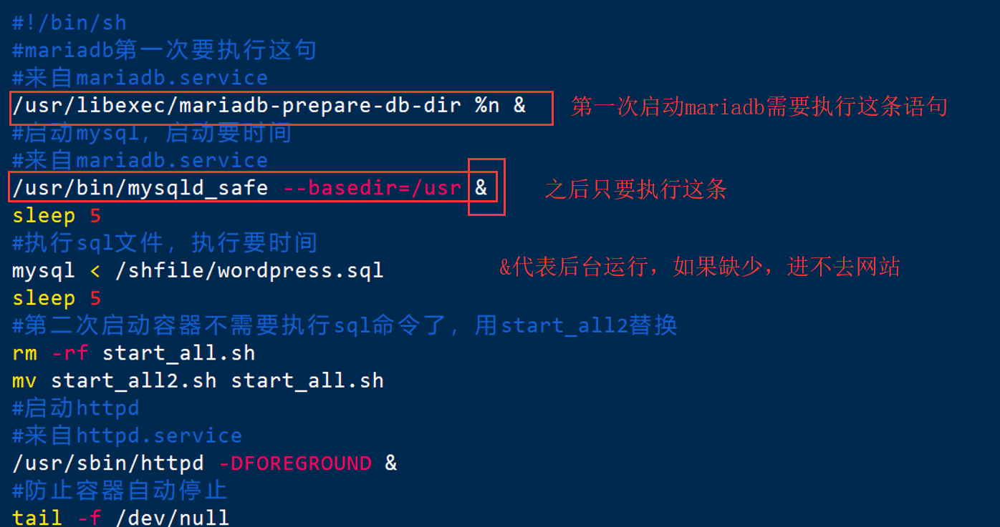

**start_all2.sh**

第二次后启动容器后执行，用于开启httpd和mysql服务

启动和停止的语句来自各自的service文件。


**sql文件**

为WordPress创建一个MySQL数据库

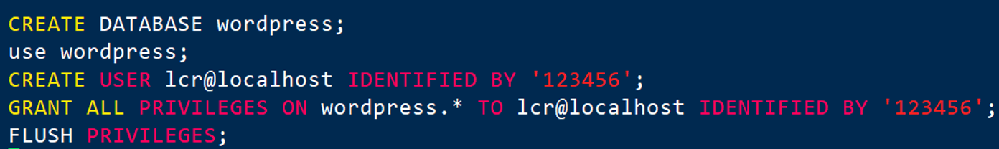

#### **4. 构建镜像**

```
docker build -t mywp .
```

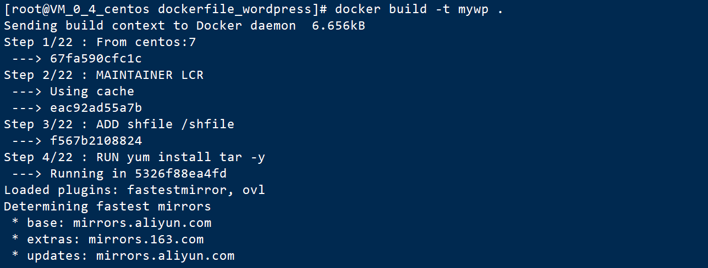

构建中...

构建成功


#### **5. 运行容器并验证**

```
docker run -d -it -p 8989:80 mywp
```

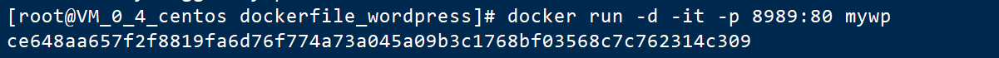

```
docker ps
```

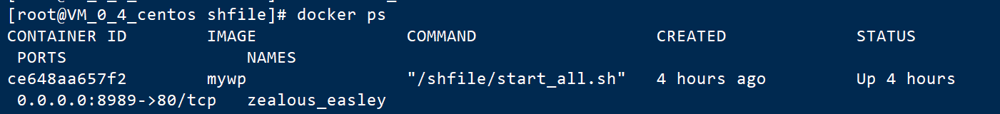

#### **6. 验证容器中的服务是否都安装成功**

**进入容器前台**

```
docker exec -it ce6 /bin/bash
```

**容器里进入Mysql ，并查看数据库（说明mysql安装成功）**

```
mysql
show databases;
```

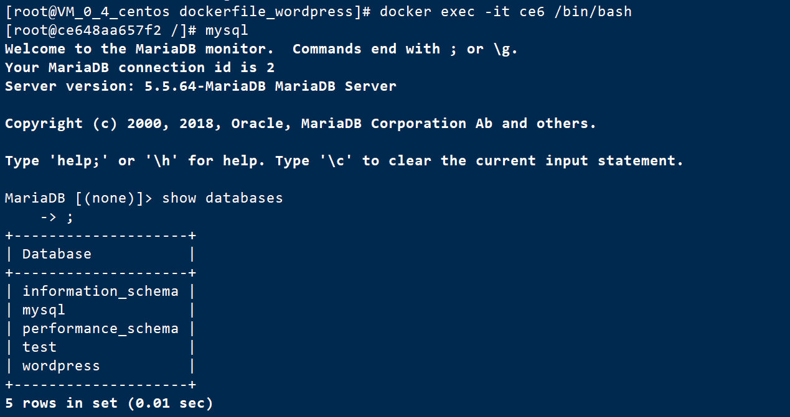

**查看php版本（说明php安装成功）**

```
php -v
```

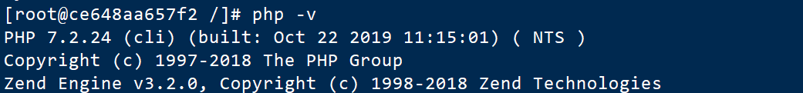

**浏览器查看ip:8989（说明apache web、wordpress安装成功）**

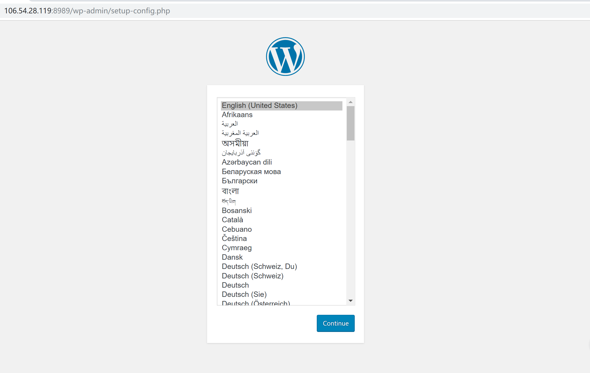

#### **7. Web里配置wordpress**

**输入数据库用户名和密码**

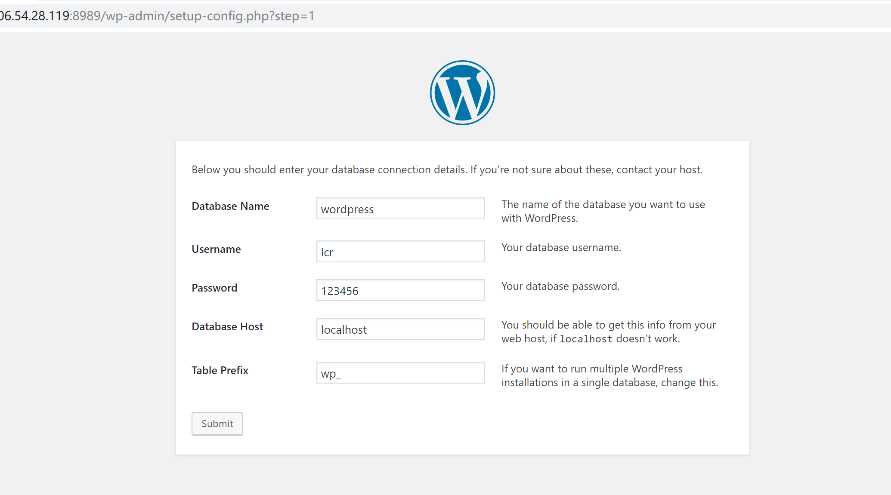

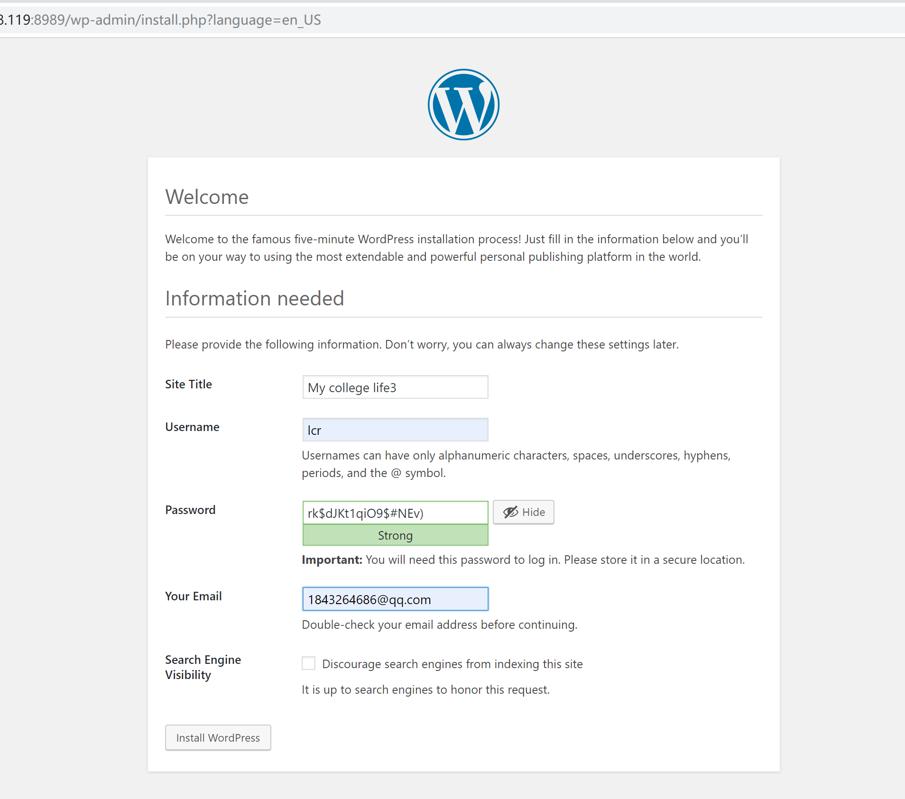

**成功进入，端口映射为8989**

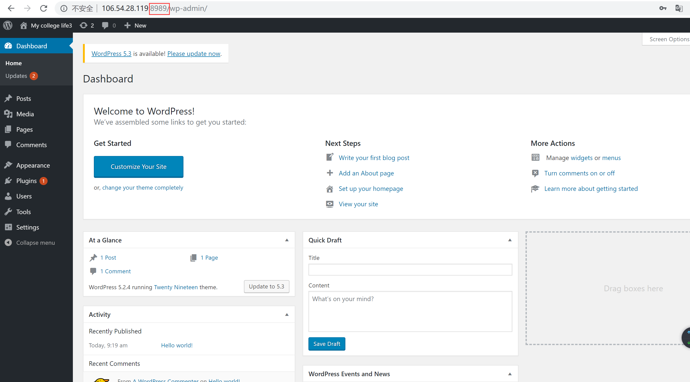