## Ceph的安装与实践

### 1.配置所有节点

**最小安装一台centos虚拟机**

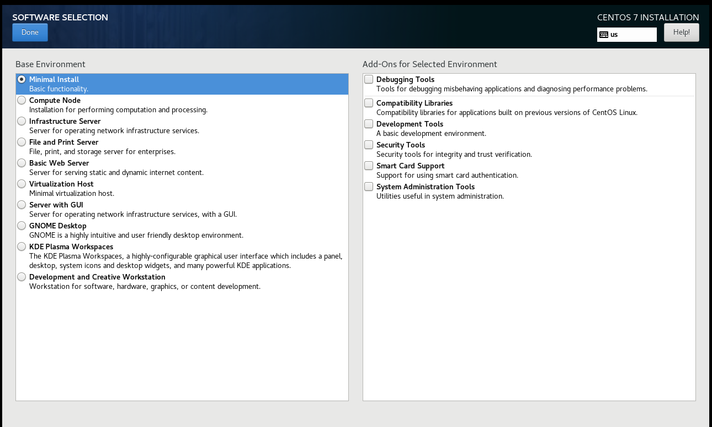

**添加用户并配置sudo权限**

```
useradd -d /home/cephuser -m cephuser

passwd cephuser

echo "cephuser ALL = (root) NOPASSWD:ALL" | sudo tee /etc/sudoers.d/cephuser

chmod 0440 /etc/sudoers.d/cephuser

sed -i s'/Defaults requiretty/#Defaults requiretty'/g /etc/sudoers
```

**安装设置open-vm-tools服务自动启动**

```
yum install -y open-vm-tools

systemctl enable vmtoolsd

systemctl start vmtoolsd
```

**安装配置ntp服务**

```
yum install -y ntp ntpdate ntp-doc

ntpdate 0.us.pool.ntp.org

hwclock --systohc

systemctl enable ntpd.service

systemctl start ntpd.service
```

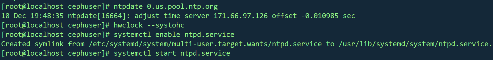

**禁用SELINUX**

```
sed -i 's/SELINUX=enforcing/SELINUX=disabled/g' /etc/selinux/config
```

**添加ceph仓库：**

```
sudo vi /etc/yum.repos.d/ceph.repo
```

**文件内容**

```
[ceph]

name=Ceph packages for $basearch

baseurl=http://mirrors.163.com/ceph/rpm-jewel/el7/$basearch

enabled=1

gpgcheck=0

priority=1

type=rpm-md

gpgkey=http://mirrors.163.com/ceph/keys/release.asc

 

[ceph-noarch]

name=Ceph noarch packages

baseurl=http://mirrors.163.com/ceph/rpm-jewel/el7/noarch

enabled=1

gpgcheck=0

priority=1

type=rpm-md

gpgkey=http://mirrors.163.com/ceph/keys/release.asc

 

[ceph-source]

name=Ceph source packages

baseurl=http://mirrors.163.com/ceph/rpm-jewel/el7/SRPMS

enabled=0

gpgcheck=0

type=rpm-md

gpgkey=http://mirrors.163.com/ceph/keys/release.asc

priority=1
```

**防火墙设置**

开启

```
systemctl start firewalld
```

自启

```
systemctl enable firewalld
```

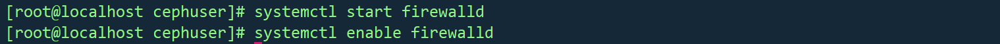

因为需要所有节点在虚拟机上运行

```
yum install -y open-vm-tools
```

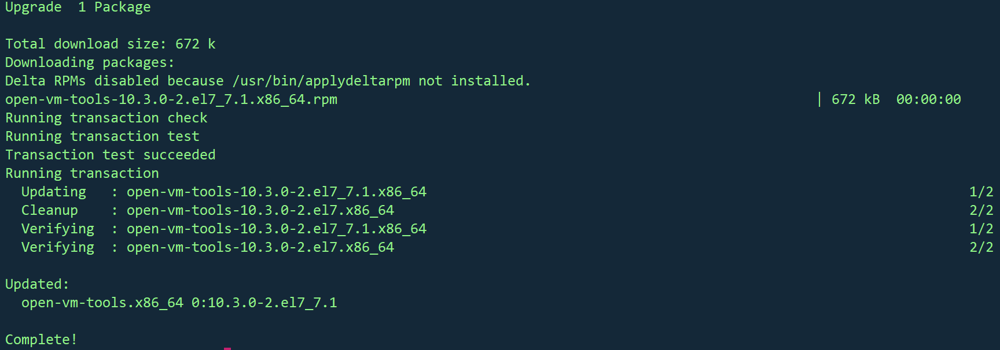

**克隆为三台机器**

**Admin**

IP：192.168.85.134

**Mon1**

Ip：192.168.85.137

**osd1**

Ip：192.168.85.135

**osd2**

Ip：192.168.85.138

**主控节点防火墙**

```
sudo firewall-cmd --zone=public --add-port=80/tcp --permanent

sudo firewall-cmd --zone=public --add-port=2003/tcp --permanent

sudo firewall-cmd --zone=public --add-port=4505-4506/tcp --permanent

sudo firewall-cmd --reload
```

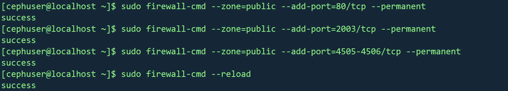

**monistor节点防火墙**

```
sudo firewall-cmd --zone=public --add-port=6789/tcp --permanent

sudo firewall-cmd --reload
```

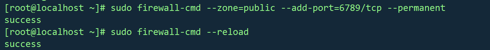

**普通节点防火墙**

```
sudo firewall-cmd --zone=public --add-port=6800-7300/tcp --permanent

sudo firewall-cmd --reload  
```

### 2. 配置SSH服务器

**主控节点**

```
vi /etc/hosts
```

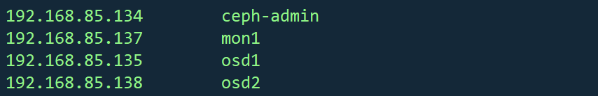

**设置免密登录ssh**

```
su - cephuser
```

**生成密钥**

```
ssh-keygen
```

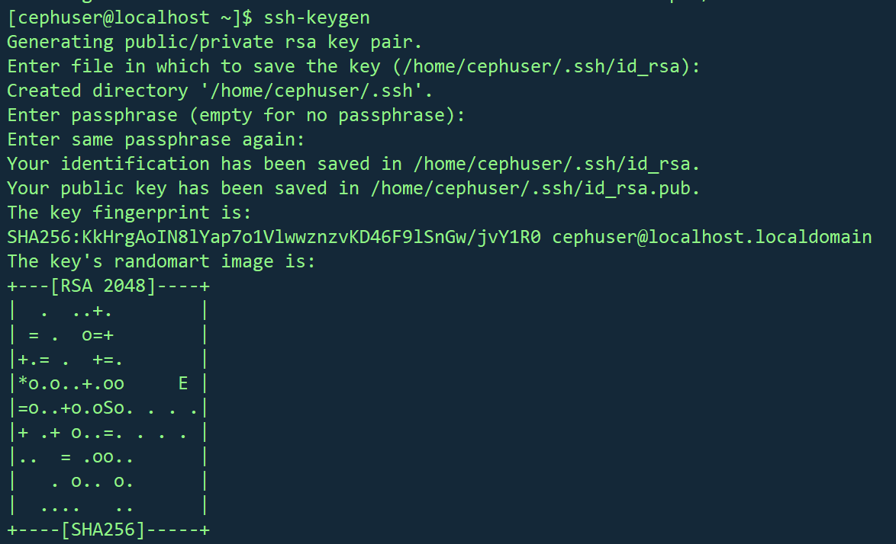

```
vi ~/.ssh/config
```

文件内容如下：

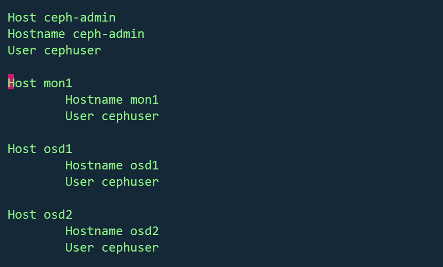

 **更改配置文件的权限**

```
chmod 644 ~/.ssh/config

ssh-keyscan osd1 osd2 mon1 >> ~/.ssh/known_hosts
```

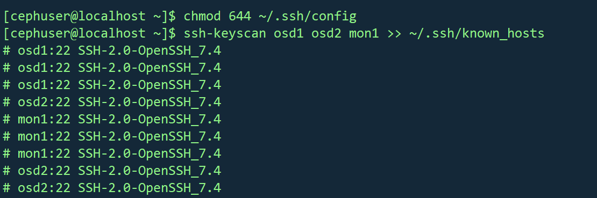

使用ssh-copy-id命令将SSH密钥添加到所有节点。

```
ssh-copy-id ceph-admin

ssh-copy-id mon1

ssh-copy-id osd1

ssh-copy-id osd2
```

**测试连接各节点ssh**

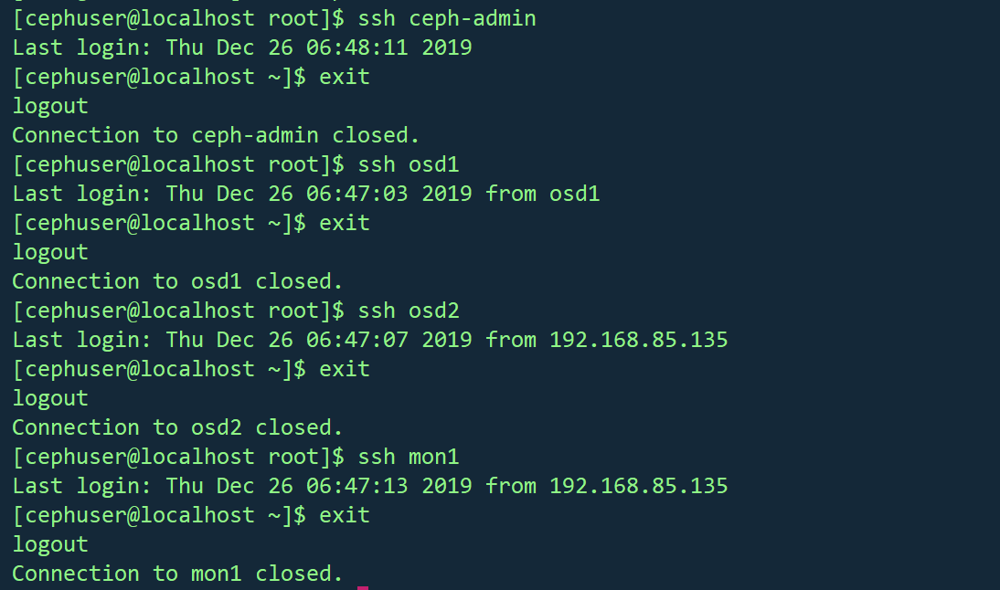

### 3. ceph-deploy安装 

```
sudo yum update && sudo yum install ceph-deploy
```

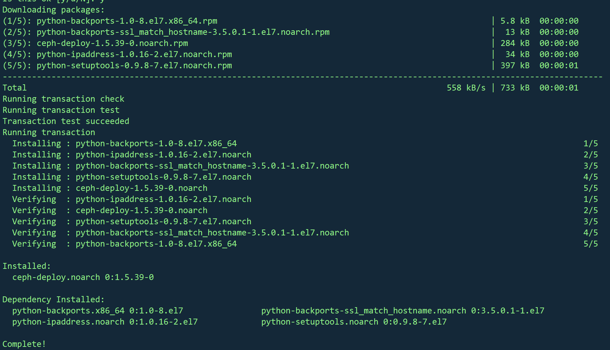

### **4. 创建集群**

```
mkdir cluster && cd cluster

ceph-deploy new mon1

vi ceph.conf
```

文件内容:

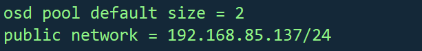

### 5. 在所有节点上安装Ceph

```
ceph-deploy install ceph-admin mon1 osd1 osd2
```

**查看ceph version**

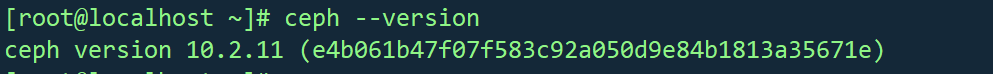

需要mon1节点执行

```
hostnamectl set-hostname mon1
```

修改主机名为mon1

**主控节点**

```
ceph-deploy mon create-initial

ceph-deploy gatherkeys mon1
```

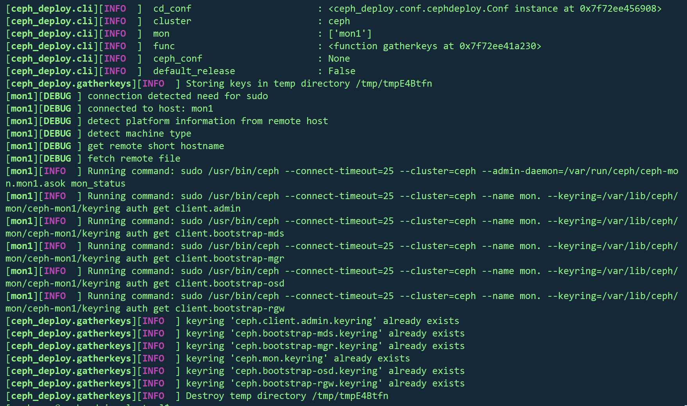

**为osd守护进程创建目录 **

**osd节点：**

```
sudo mkdir /var/local/osd

sudo chown ceph: /var/local/osd
```

**主控节点**

 将管理密钥部署到所有关联的节点。 

```
准备所有OSDS节点
ceph-deploy osd prepare osd1:/var/local/osd osd2:/var/local/osd

激活OSD
ceph-deploy osd activate osd1:/var/local/osd osd2:/var/local/osd

将管理密钥部署到所有关联的节点。
ceph-deploy admin ceph-admin mon1 osd1 osd2
```

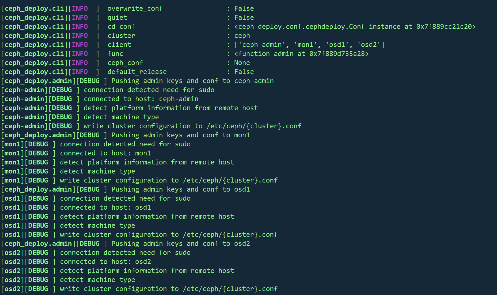

通过在所有节点上运行以下命令来更改密钥文件的权限 

```
sudo chmod 644 /etc/ceph/ceph.client.admin.keyring
```

## 6.检查集群状态  

**从ceph-admin节点登录到ceph监视服务器“ mon1 ”， 运行以下命令以检查集群运行状况。 **

```
ssh mon1

sudo ceph health
```

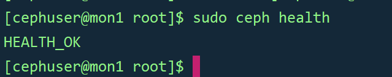

**检查集群状态**

```
sudo ceph -s
```

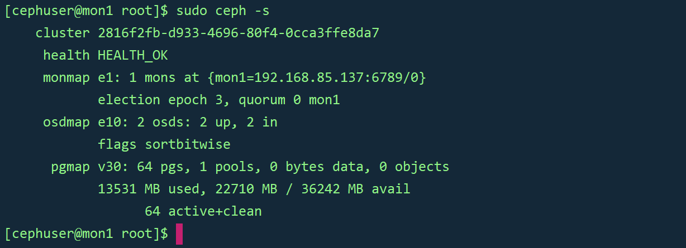

